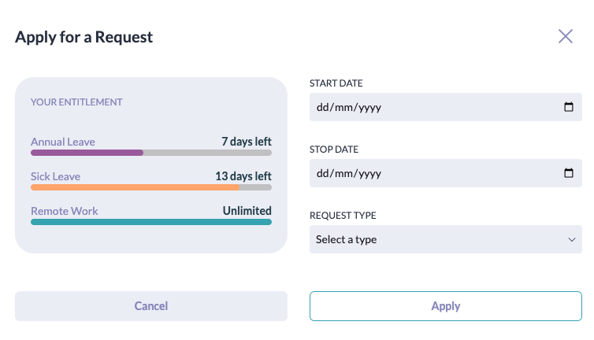
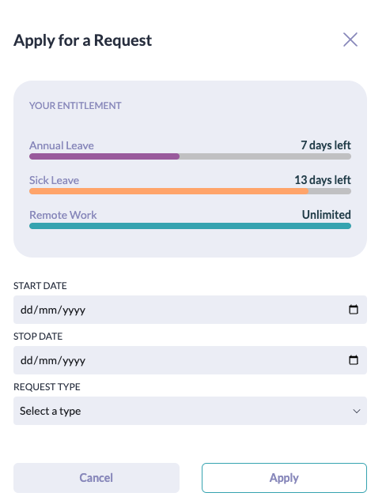

# Exercises

We're going to add or fix features in our existing Timeout app, in addition to solving some independent programming puzzle exercises. Make sure you start with reading and understanding the [README](../README.md) file to ensure you have sufficient understanding of the project's concepts, architecture and installation instructions.

Lint the project after every exercise to make sure there are no errors or warnings. Refer to the README for instructions on how to run the lint command in the terminal. Not fixing the lint errors won't prevent you from proceeding to the next exercise but it will deduct points.

## Exercise 1

If you resize the browser to a smaller width you will notice that the app layout changes to adapt to the new dimensions. This is called [responsive web design](https://en.wikipedia.org/wiki/Responsive_web_design). When the browser width is between 500px and 1024px, the app displays the "small" breakpoint (e.g., the main menu is at the top of the page). When the browser is wider than 1024px, the app displays the "large" breakpoint (e.g., the main menu is on the left side of the page).

While most of the app is responsive, we unfortunately forgot to make one feature responsive: the "Apply for a Request" modal. That modal can be accessed by clicking on the "Apply for Request" button in the dashboard page. When you resize the browser, it doesn't correctly adapt for small screens. We're going to use Tailwind to support small screen sizes:

**For screens < 1024px**

- The modal should fill the entire page
- The modal should be scrollable if the content doesn't fit vertically on the screen
- The modal should not have an animation on entrance the way it does on large screens

**For screens < 768px**

- The UI elements in the modal should be stacked vertically (instead of them being in a 2-column grid).

Commit your changes using git with the message "Make the Apply modal responsive".

### Hints

- Check the [Tailwind docs](https://tailwindcss.com/docs/responsive-design) on building responsive designs
- Locate the component in the codebase responsible for the "Apply" modal and update it accordingly

## Exercise 2

The current Requests page and Timesheet page both have a search input field but their search fields don't work. Let's add search functionality for both pages.

- The search should happen on the frontend for faster feedback and not make any calls to the backend.
- The search should happen as the user types.
- The Timesheet page search should match the records if the search field contains a substring of an employee's full name, e.g., "loth" should show both "Ragnar Lothbrok" and "Lagertha Lothbrok" rows.
- The Requests table search should match the records if the search field either contains a substring of the employee's full name, or it matches a row's type (e.g., "Sick Leave"), or a request's status (e.g., "Pending").
- Commit your changes using git with the message "Add search functionality".

### Useful References

- [React Events](https://react.dev/learn/responding-to-events)
- [React useState](https://react.dev/reference/react/useState)
- [React input](https://react.dev/reference/react-dom/components/input)

## Exercise 3

The leaves in our database are not all approved. They can be either pending, approved, or rejected. We currently display all requests on all pages which can be misleading. The type of leave requests need to be filtered based on the page:

- Dashboard (Entitlement widget): should only include pending and approved leaves.
- Requests: the table should display all leaves (pending, approved, rejected). This should already be the case.
- Timesheet: the table should only display approved leaves.

The filtering should happen in the backend to avoid sending unneeded data across the network.

Commit your changes using git with the message "Filter leave requests by status".

### Hints

- Check the leave requests database schema to understand how to identify approved leaves.
- Find the tRPC procedure being called by each page to know where and what to filter.

### Useful References

- [Drizzle schema declaration](https://orm.drizzle.team/docs/sql-schema-declaration)
- [TRPC procedures](https://trpc.io/docs/server/procedures)

## Exercise 4

As a continuation to the previous exercise, we want newly submitted leave requests to default as pending instead of approved. That way the admin can later approve or reject the leaves from the Requests table.

- All newly created leave requests should be defaulted by the backend as "pending".
- In the Requests table, when (and only when) a request is pending, display two buttons, "Approve" and "Reject".
- Create a new tRPC procedure called `updateStatus` that updates the leave request's status when one of the above buttons is clicked.
- Commit your changes using git with the message "Add approval/rejection functionality".

### Hints

- The Approve/Reject buttons' JSX is already written but commented out, you don't need to create them from scratch.
- You can learn a lot from the Apply Dialog on how to work with mutations.

#### Useful References

- [TanStack Query mutations](https://tanstack.com/query/v4/docs/react/guides/mutations)
- [tRPC + TanStack Query useMutation](https://trpc.io/docs/client/react/useMutation)
- [tRPC Query Invalidation](https://trpc.io/docs/client/react/useUtils#query-invalidation)
- [tRPC Procedures](https://trpc.io/docs/server/procedures)
- [Drizzle Update](https://orm.drizzle.team/docs/update)
- [React Events](https://react.dev/learn/responding-to-events)
- [React Conditional Rendering &&](https://react.dev/learn/conditional-rendering#logical-and-operator-)

## Exercise 5

Since the user is also an employee themselves, when looking at the Timesheet table, it's good to let them know when the record they're looking at is themselves instead of another employee. For the row in the Timesheet table referring to the current user themselves, do the following:

- Add the text "(You)" next to the employee's name.
- Add a blue top and bottom border to all the cells in that row.
- The table cell containing the employee's name should have a blue background and white text (only the first column in the row).

Remember that the above only apply for rows about the current user and not for records of other employees.

Commit your changes using git with the message "Highlight the current user row in the timesheet".

### Hints

- This is a frontend-only exercise.
- We are already using the current user in the Profile Header component, so you can use it as a guide on how to get the current user.

### Useful References

- [React Context](https://react.dev/learn/passing-data-deeply-with-context)
- [React Custom Hooks](https://react.dev/learn/reusing-logic-with-custom-hooks)
- [React Conditional Rendering &&](https://react.dev/learn/conditional-rendering#logical-and-operator-)

## Exercise 6

The leave calculations currently count all days in a date range. This is inaccurate as weekends shouldn't count as leaves. That means that a date range of Monday to Sunday should only count as 5 days. Let's update the Dashboard, Requests, and Timesheet page to reflect that. Commit your changes using git with the message "Account for weekends in leave calculations".

### Dashboard

The entitlement widget in the dashboard should not count weekends when deducting remaining leaves. Update the tRPC procedure responsible for this to not count weekends as "taken" leaves.

### Timesheet

Similar to the dashboard entitlement widget, the timesheet table should always display the text "Weekend" under Saturday and Sunday even if the day falls within a leave. Update the backend and frontend accordingly.

### Requests Table

The "Requests" table has a date range, however it can be difficult to know the number of working days each request entails. Let's add a column called "Working Days" that would display the number of days involved. The number of days should of course exclude weekends.

- The tRPC response should contain the number of working days via an additional field called `countWorkingDays`.
- The "Working Days" column should come right after the "Type" column.

### Hints

- Most of the tRPC procedures use a shared function to calculate date details of a leave. If you can update that shared function to implement this feature you'll be able to solve it in more than one place.

### Useful References

- [date-fns](https://date-fns.org/)

## Exercise 7

After the previous exercise, the leave calculations now exclude weekends. If an employee takes a leave from Monday to Sunday, we only count it as a 5 days leave instead of 7 days. However this doesn't account for holidays. In the mentioned example, if Tuesday was a public holiday, then it should count as 4 days instead of 5. Let's start accounting for holidays.

- Create a table called `holidays`, with columns `id`, `name`, `date`. You can do that in the schema file.
- You can use the `pnpm db:migrate` command in the `backend` directory to run the database migration.
- Update the `seed` script to create a holiday called "Thor's Day" that happens on any weekday of your choosing in the next 10 days.
- You'll need to re-run the seed data using the `pnpm db:seed` command inside the `backend` directory.
- You may need to restart the server for changes to take effect
- Update the previous exercise's solution to also account for holidays (the same way we did for weekends).
- The Timesheet should display the name of the holiday in the holiday columns.
- Commit your changes using git with the message "Add holiday functionality".

### Useful References

- [Drizzle schema declaration](https://orm.drizzle.team/docs/sql-schema-declaration)
- [Drizzle Migrations](https://orm.drizzle.team/docs/migrations)
- [Drizzle Query](https://orm.drizzle.team/docs/rqb)
- [Drizzle Insert](https://orm.drizzle.team/docs/insert)
- [date-fns](https://date-fns.org/)
- [SQLite Browser](https://sqlitebrowser.org/)

## Exercise 8

The "Apply for Request" functionality is lacking backend validations. This could lead to invalid data in the database. We're going to add two types of backend validations when applying for a request:

- An employee cannot select an end date earlier than the start date. If that happens, the request should fail with the message "End date should be greater or equal to the start date".
- An employee cannot apply for a leave when they don't have enough days allowed. For example if an employee has 3 remaining sick leaves and applies for a sick leave containing 5 working days, the creation should fail with an error message "Leave request exceeds the allowed days". For leave requests that span across multiple years, make sure you validate each year individually. That means if the request is for an annual leave from December 2024 to January 2025, we will separately validate the number of working days in December 2024 against the employee's remaining annual leave credit for 2024, and validate the number of working days in January 2025 against the employee's 2025 annual leave credit.
- Commit your changes using git with the message "Add validation when applying for a leave".

### Hints

- Straightforward input validations should live in the tRPC procedure's input validator.
- More complicated input validations that include database queries would live in the `mutation` function fo the tRPC procedure.
- Don't forget to only count working days during validations (exclude weekends and holidays).

### Useful Resources

- [tRPC Input Validators](https://trpc.io/docs/server/validators#input-validators)

## Exercise 9

This is a puzzle exercise, independent of the rest of the application. When you visit the [Clock Puzzle page](http://localhost:5173/puzzles/clock) you will find two clocks. One clock gives the time down to the second, and the other down to the minute. By only updating the code inside the `useCurrentTime` hook (where marked), you need to ensure that each of the clocks re-renders the minimum amount of times needed to display up-to-date time. Don't worry about [Strict Mode](https://react.dev/reference/react/StrictMode#fixing-bugs-found-by-double-rendering-in-development) double renders, they only count as one render.

Commit your changes using git with the message "Clock Puzzle".

### Useful References

- [React Custom Hooks](https://react.dev/learn/reusing-logic-with-custom-hooks)
- [React useState](https://react.dev/reference/react/useState)
- [React useEffect](https://react.dev/reference/react/useEffect)

## Exercise 10

This is a puzzle exercise, independent of the rest of the application. When you visit the [Speak Puzzle page](http://localhost:5173/puzzles/speak), the file `speak.page.jsx` will execute. Currently the component renders a "Failed" message. You need to update the `speak` function such that the component renders that a "Passed" message. You can only edit the code inside the `speak` where indicated and nowhere else.

Commit your changes using git with the message "Speak Puzzle".
